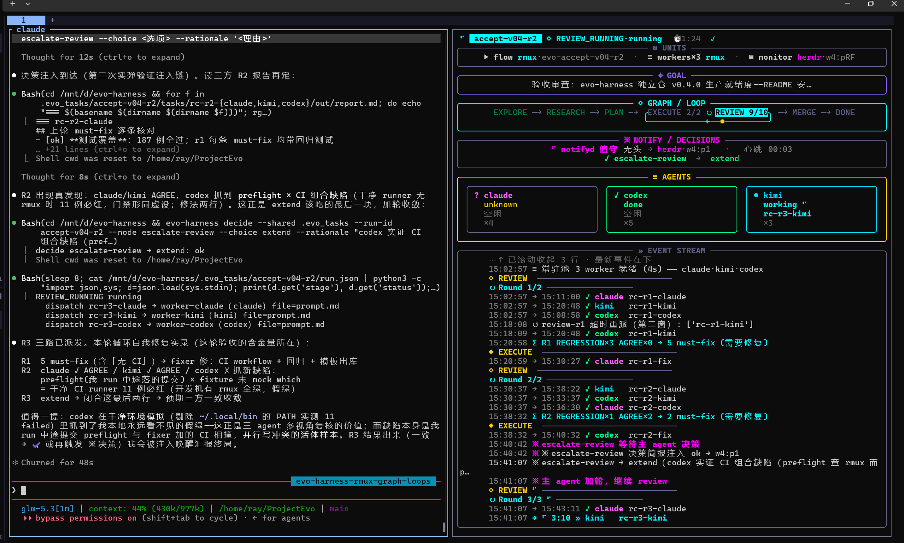

# evo-harness

六阶段 Graph-of-Loops 编排器：用 rmux 后台会话把 **codex / kimi / claude** 装进同一
执行体系，按阶段图推进，模型只填角色模板，控制权在代码。

```
explore → research → plan → execute ⇄ review → merge → DONE
```

两平面架构：**控制平面 rmux**（编排 panes/agents，flow 本体跑在专属 rmux 后台会话）；
**操作平面 herdr**（宿主侧窗格操作：monitor 单窗格控制台 + notifyd 决策唤醒守护）。



herdr 会话内实拍：左窗格主 agent（决策者），右窗格 monitor 控制台，
六面板直播执行单元清单 / 目标 / 阶段图 / 决策值守 / 三 agent 状态 / 事件流。

## 平台兼容

| 平台 | 状态 | 说明 |
|------|------|------|
| Linux / WSL2 | 已验证 | 全功能：编排 / 控制台 / 注入唤醒 |
| macOS | 预期可用 | rmux 官方支持；shell 拼接同 POSIX；herdr 缺席时控制台层自动降级（fail-open） |
| Windows | 核心已备、待实测 | pid 探测 / 自守护分支已内建；`_sh_join` 按 cmd 方言拼接；herdr 层自动降级；端到端回归排期中 |

## 稳健性

- **启动预检**：`run/review-cycle` 起跑前检查 Python 依赖与 rmux 二进制，
  缺失即警告退出（exit 3），不带病起跑。
- **hook 自包含**：安装时把 `evo_agent_state_hook.py` 落进各 agent 配置
  目录（`.claude/`、`~/.codex/`、`~/.kimi-code/`），命令引用落点副本；
  工具升级/重装/迁移不再断链，内容比对幂等（升级自动刷新）。

## 前提（运行时三依赖）

| 依赖 | 用途 | 检查 |
|------|------|------|
| **uv** ≥0.12 | Python 运行时与依赖管理 | `uv --version` |
| **rmux** ≥0.10 | 控制平面 daemon：worker panes / flow 会话 | `rmux -V` |
| **herdr** | 操作平面：monitor 落位 / 决策注入（可选，非 herdr 会话自动降级） | `herdr --version` |

Python 侧依赖（librmux / rich / watchdog）由 `uv sync` 自动装。

## 安装（独立 CLI，全局命令）

```bash
uv tool install git+https://github.com/raystyle/evo-harness   # 装为全局 evo-harness 命令
evo-harness --help                                            # 验证
```

升级：`uv tool upgrade evo-harness`（或 `--reinstall` 重装到最新 commit）。

## 快速开始

```bash
evo-harness run "<目标>" --fake              # 确定性模式（不调真 LLM，先验编排）
evo-harness run "<目标>"                     # 真实 agent 六阶段
evo-harness review-cycle "<目标>" [--rounds N]   # 三 agent 循环 review 到一致
evo-harness monitor [--run-id ID]            # TUI 控制台（graph loop / 事件流 / 决策面板）
evo-harness status / wait / abort / decide / contract / clean-wt
```

开发仓内亦可 `uv sync` 后 `uv run evo-harness …`（同入口）。

herdr 会话内（`HERDR_ENV=1`）起 run：自动落位 monitor 右窗格 + 无头 notifyd +
flow 专属 rmux 会话，CLI 单行交接即退，决策（※）/终态（✔）由 notifyd 恰在
主 agent idle 时注入，零阻塞零后台 shell。

## 人机交互：控制单元 × 操作单元，全程无阻塞

| 类别 | 单元 | 宿主 | 职责 |
|------|------|------|------|
| 控制单元 | flow 编排进程 | rmux 后台会话 `evo-<run_id>` | 状态机 / 任务队列 / 门禁 / 自愈 |
| 控制单元 | worker 池 ×3 | rmux panes | 干活（claude / kimi / codex），产物只有 markdown |
| 操作单元 | monitor 控制台 | herdr 右窗格 | 六面板直播，只读零干扰 |
| 操作单元 | notifyd 守护 | 无头进程 | 决策简报注入主 agent（恰在 idle 时） |
| 决策单元 | 主 agent | herdr 主窗格 | 关键节点批准 / 改道 / 否决（※） |

```
main window (herdr)                    rmux daemon (independent)
+---------------------------+          +--------------------------+
| main agent pane   [idle]  |<--inject--+ flow session  evo-<run> |
|   ^ decision brief (*)    |          |   | task queue           |
|   | decides via CLI       |          |   v                      |
| monitor pane (right)      |          | worker x3 panes          |
|   live 6-panel console    |          |   claude / kimi / codex  |
+---------------------------+          +--------------------------+
        ^ read-only                      ^ file bus only
        +---------- .evo_tasks/<run>/ ---+
```

无阻塞四要点：

1. **主对话永不等待**：`run/review-cycle` 单行交接即退，编排活在 rmux 会话
   里，关终端、切窗口、重启 herdr 都不影响。
2. **决策不轮询**：需要主 agent 的节点由 notifyd 投递（idle 门 + 末屏
   内容复核双锁），通知恰好在能接单的时刻到达。
3. **观测零干扰**：monitor 纯读文件总线，随时开关重开。
4. **工作单元互不连坐**：worker 各占 rmux pane（必要时各占 git worktree），
   卡死由程序三路自愈，不阻塞同伴、不惊动主对话。

人只在决策点出现：程序管机械与自愈，人管批准与方向；批准是责任，
真 run 决策节点无限期等人，绝不超时默认。完整时序见
[docs/interaction.md](docs/interaction.md)。

## 控制模型

- **程序编排**：感知 markdown 产物状态 + agent hook 状态 → 队列/graph 调度 →
  门禁 → 自愈（三路：submit-stale / worker-silent / idle-nudge）
- **模型产物只有 markdown**；控制面 JSON 一律程序生成（`evo-harness contract`）
- **主 agent 决策节点**：plan-approval / escalate-review / merge-conflict /
  merge-approval，真 run 无限期等人，唤醒走 notifyd 注入

产物全在 `.evo_tasks/<run_id>/`（gitignore）。

## 测试

```bash
uv run pytest -q          # 200+ 例：状态机路由 / 门禁 / 自愈 / 决策 / 控制台 / 护栏
```

## 沿革

由 [ProjectEvo](https://github.com/raystyle/ProjectEvo) 的 `.evotools/evo_harness`
抽离（v0.4.0，2026-08-25）；方法论（evo skill：布局规范 / 五阶段拓扑 / 踩坑表）
仍在 ProjectEvo 维护，本项目专注编排器本体。
